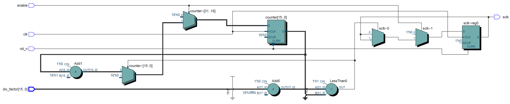
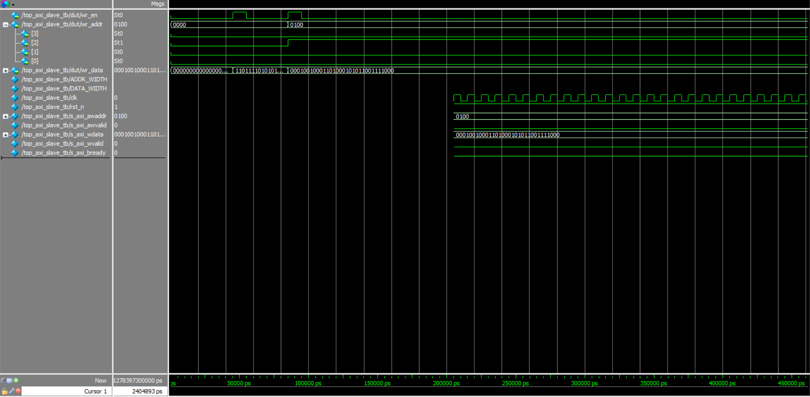

# AXI-Lite Write-Only Slave RTL

This project implements a Verilog RTL module for an AXI-Lite write-only slave interface. It uses a finite state machine (FSM) to handle protocol control and stores written data into a register block. The functionality is validated via ModelSim simulation and waveform analysis.

---

## 🔧 Features

- AXI-Lite write-only interface (AW, W, B channels)
- FSM-based AXI handshake and write controller (`axi_slave_write_fsm.v`)
- Internal register block for data storage (`reg_block.v`)
- Top module connects FSM and register logic (`top_axi_slave.v`)
- Testbench with 2 write transactions (`top_axi_slave_tb.v`)
- Verified using ModelSim waveform viewer

---

## 📁 File Overview

| File                          | Description                              |
|-------------------------------|------------------------------------------|
| `axi_slave_write_fsm.v`       | FSM for AXI write channel handshaking    |
| `reg_block.v`                 | 32-bit wide write-only register block    |
| `top_axi_slave.v`             | Top-level integration module             |
| `top_axi_slave_tb.v`          | Testbench for AXI write verification     |
| `RTL_axi_slave.png`           | RTL block diagram                        |
| `wave_top_axi_slave_tb.png`   | ModelSim waveform of write transactions  |

---

## 🖼️ RTL Architecture

The block diagram below illustrates the overall structure, including FSM, write logic, and register block.



---

## 📷 AXI Write Simulation Waveform

The waveform below shows:
- Two write transactions issued by the testbench
- Handshake behavior on `awvalid`, `wvalid`, `awready`, `wready`
- Write enable pulse `wr_en` and write data/addresses



---

## ▶️ How to Simulate (ModelSim)

```tcl
vlib work
vlog axi_slave_write_fsm.v reg_block.v top_axi_slave.v
vlog top_axi_slave_tb.v
vsim work.top_axi_slave_tb
add wave -r *
run 1000ns

# AXI-Lite Write-Only Slave RTL

This project implements a Verilog RTL module for an AXI-Lite write-only slave interface. It uses a finite state machine (FSM) to handle protocol control and stores written data into a register block. The functionality is validated via ModelSim simulation and waveform analysis.

---

## 🔧 Features

- AXI-Lite write-only interface (AW, W, B channels)
- FSM-based AXI handshake and write controller (`axi_slave_write_fsm.v`)
- Internal register block for data storage (`reg_block.v`)
- Top module connects FSM and register logic (`top_axi_slave.v`)
- Testbench with 2 write transactions (`top_axi_slave_tb.v`)
- Verified using ModelSim waveform viewer

---

## 📁 File Overview

| File                          | Description                              |
|-------------------------------|------------------------------------------|
| `axi_slave_write_fsm.v`       | FSM for AXI write channel handshaking    |
| `reg_block.v`                 | 32-bit wide write-only register block    |
| `top_axi_slave.v`             | Top-level integration module             |
| `top_axi_slave_tb.v`          | Testbench for AXI write verification     |
| `RTL_axi_slave.png`           | RTL block diagram                        |
| `wave_top_axi_slave_tb.png`   | ModelSim waveform of write transactions  |

---

## 🖼️ RTL Architecture

The block diagram below illustrates the overall structure, including FSM, write logic, and register block.


---

## 📷 AXI Write Simulation Waveform

The waveform below shows:
- Two write transactions issued by the testbench
- Handshake behavior on `awvalid`, `wvalid`, `awready`, `wready`
- Write enable pulse `wr_en` and write data/addresses


---

## ▶️ How to Simulate (ModelSim)

```tcl
vlib work
vlog axi_slave_write_fsm.v reg_block.v top_axi_slave.v
vlog top_axi_slave_tb.v
vsim work.top_axi_slave_tb
add wave -r *
run 1000ns
---

## ✅ Expected Behavior
The testbench issues two AXI write operations:
1. Write 0xDEADBEEF to address 0x0
2. Write 0x12345678 to address 0x4
Each transaction should:
- Complete with valid bvalid and bresp signals
- Trigger wr_en signal from FSM
- Write correct data into internal register block


